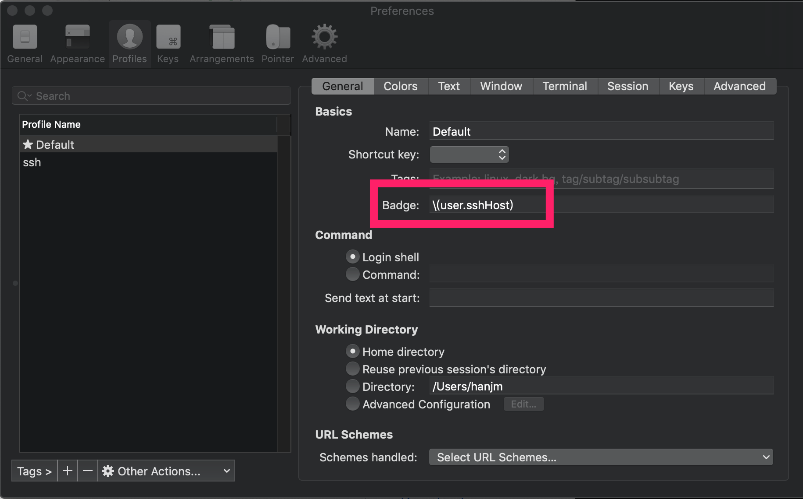
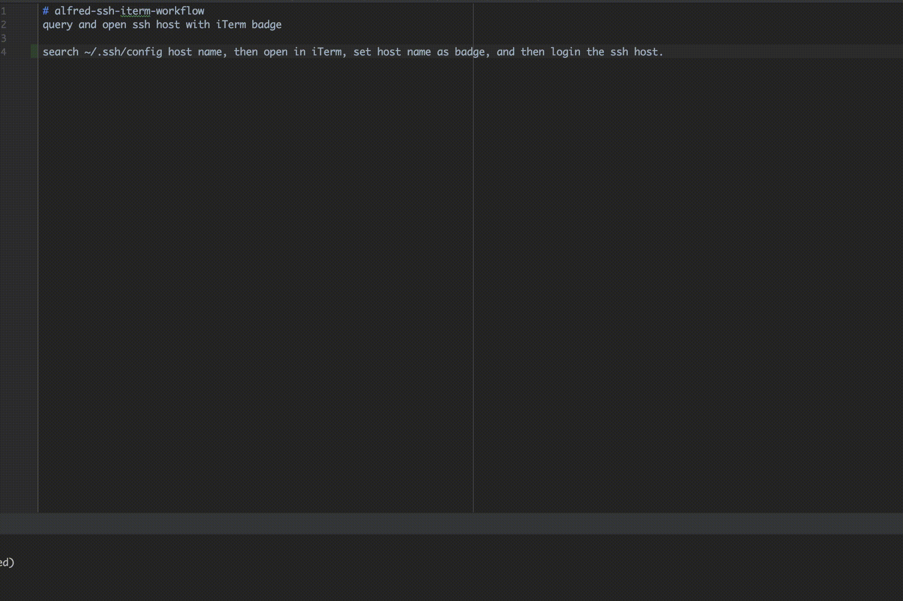

# alfred-ssh-iterm-workflow
Query and open ssh host with iTerm badge

## Workflow

search ~/.ssh/config host name, then open in iTerm, set host name as badge, and then login the ssh host.

## How to use

1. [Download](https://github.com/hanjm/alfred-ssh-iterm-workflow/raw/master/build/alfred-open-ssh-host-with-iterm-badge-workflow.alfredworkflow), and import to alfred.

2. Set badge of current iTerm profile. learn more about iTerm badge <https://www.iterm2.com/documentation-badges.html>

    

3. Then
    