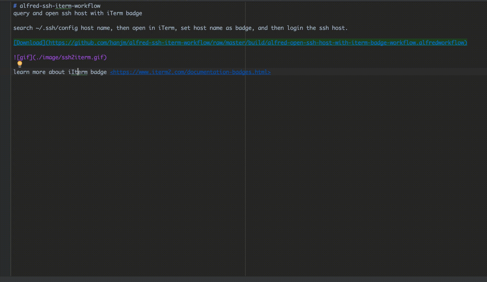

# alfred-ssh-iterm-workflow
query and open ssh host with iTerm badge

search ~/.ssh/config host name, then open in iTerm, set host name as badge, and then login the ssh host.

learn more about iIterm badge <https://www.iterm2.com/documentation-badges.html>